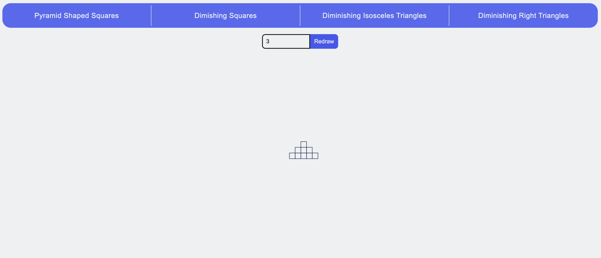
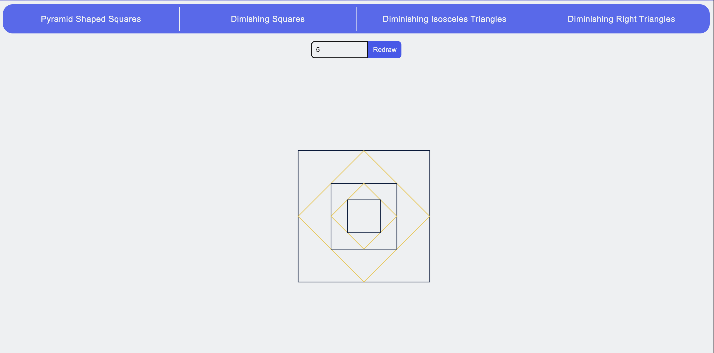
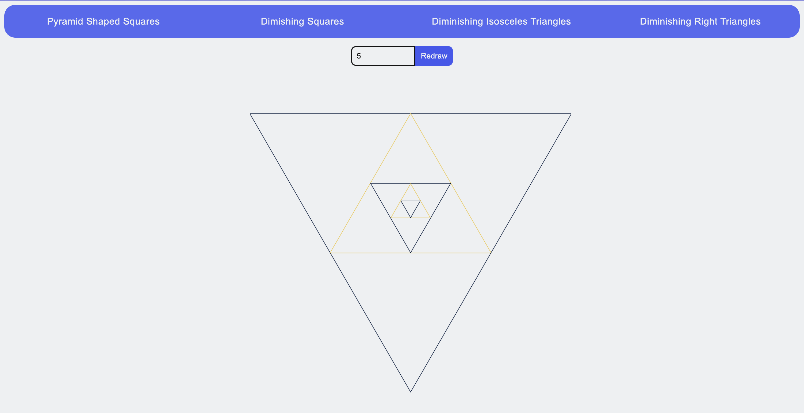
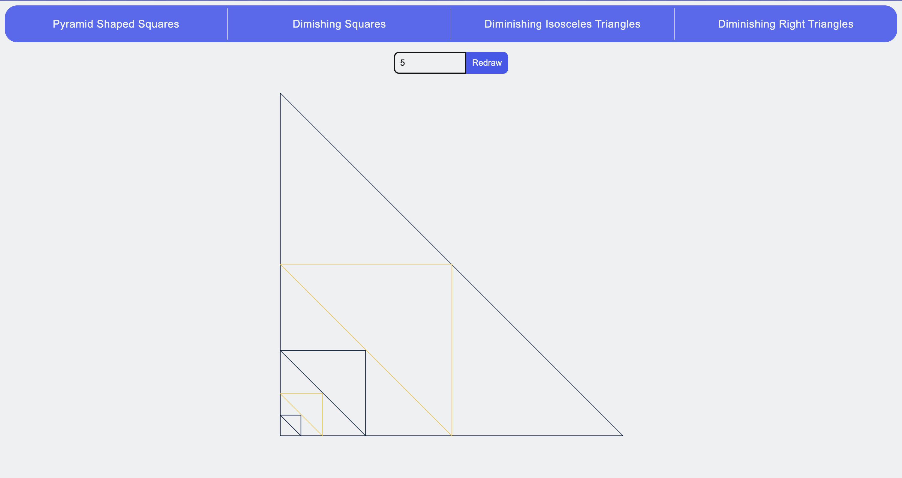

# WSEI Pattern recognition

An app that generates systems of geometric patterns like pyramid-shaped squares and diminishing triangles.

### Running project locally

```console
git clone git@github.com:pstano1/wsei-pattern-recognition.git
cd wsei-pattern-recognition
npm install
npm run start
```

### Screenshots presenting the app

<details>
  <summary>Pyramid Shaped Squares</summary>
  
</details>

<details>
  <summary>Diminishing Squares</summary>
  
</details>

<details>
  <summary>Diminishing Isosceles Triangles</summary>
  
</details>

<details>
  <summary>Diminishing Right Triangles</summary>
  
</details>
